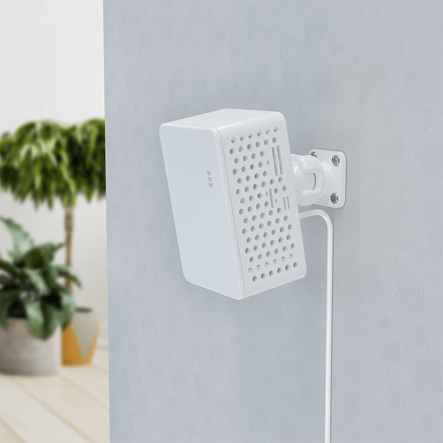

# UltimateSensor Mini for Home Assistant

Explore the UltimateSensor Mini, a compact and comprehensive sensor designed to enhance your living environment by providing real-time monitoring of various indoor conditions. Integrated seamlessly with Home Assistant and ESPHome, the UltimateSensor Mini empowers your smart home with precise data and voice-controlled actions, all without the need for cloud connectivity.

For more details, visit our website: [UltimateSensor Mini](https://ultimatesensor.nl/en/mini)

**Important Information:** The UltimateSensor Mini supports Wi-Fi connectivity. It does not include an Ethernet connection, emphasizing its streamlined, wireless setup. Are you looking for a ultimatesensor with Ethernet and PoE connection then please check out our normal UltimateSensor, read more on our website [SmartHomeShop.io](https://smarthomeshop.io)

## Key Features

- **Diverse Environmental Monitoring**: Measures CO2, humidity, temperature, light intensity, VOCs, particulate matter, and more.
- **Advanced Motion Detection**: Utilizes mmWave technology to accurately detect the position and number of people in the room.
- **Voice Control and Audio Functionalities**: Built-in microphone and speaker support voice commands and provide audio features like music playback and alarms.

## Getting Started

1. **Installation**: Designed for easy installation, the UltimateSensor Mini can be placed anywhere within your home. Whether you choose wall mounting or a freestanding setup, integration is straightforward and user-friendly.
2. **Configuration**: Seamlessly integrates with Home Assistant, allowing you to start monitoring and controlling your environment right away.

## Features

- **Real-Time Data**: Monitor your environment in real-time with detailed measurements.
- **Home Assistant Integration**: Fully compatible with Home Assistant for comprehensive smart home automation.
- **No Cloud Required**: Operates locally without the need for external cloud services.

## Kit Contents

- UltimateSensor Mini
- USB-C power cable
- Quick Start Guide

## Installation and Setup

Detailed installation instructions and the integration guide for Home Assistant can be found on our website [SmartHomeShop.io](https://smarthomeshop.io/en).

## Contributing

Interested in contributing to the UltimateSensor Mini project? Your contributions are welcome! Please submit a pull request or open an issue on this repository.

## Support

Need help or have questions? Join our [Discord community](https://smarthomeshop.io/discord) for support and to connect with other users.

## License

This project is released under the [CC BY-NC 4.0](license).

## Stay Updated

Check back for updates, new features, and community insights!