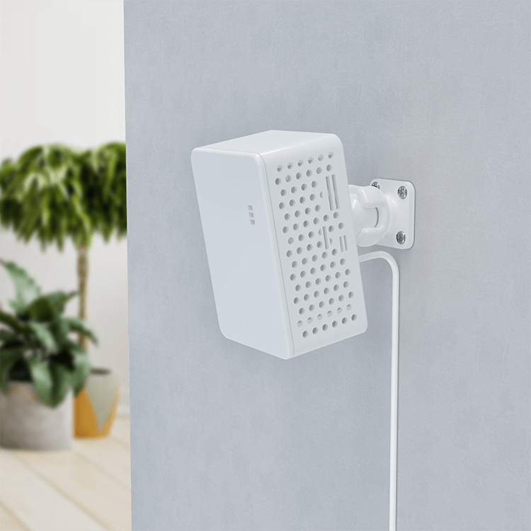

# UltimateSensor Mini for Home Assistant / ESPHome



UltimateSensor Mini is a compact all-in-one ESPHome room sensor for Home Assistant. It measures air quality, occupancy, light, temperature, humidity, and optionally particulate matter, with fully local operation by default.

Product page: https://ultimatesensor.nl/en/mini

## How It Works

UltimateSensor Mini combines multiple room sensors on one ESP32-S3 device. The ESPHome firmware exposes the measurements directly to Home Assistant and supports local onboarding through captive portal, Improv BLE, and Improv Serial.

The Complete firmware adds SPS30 particulate matter sensing for PM measurements. The Basic firmware uses the same shared configuration without the particulate matter sensor.

## Key Features

- CO2 sensing with SCD41
- Temperature and humidity sensing
- Light sensing with BH1750
- VOC and NOx index sensing with SGP41
- LD2450 mmWave occupancy sensing
- Microphone, speaker, and Home Assistant Voice Assistant support
- RGB front and back lights
- WiFi onboarding with captive portal, Improv BLE, and Improv Serial
- Fully local operation with ESPHome and Home Assistant
- Optional SPS30 particulate matter sensing in the Complete variant

## Hardware Versions

| Version | Chip | Connectivity | Description |
|---------|------|--------------|-------------|
| V1 | ESP32-S3 | WiFi | UltimateSensor Mini hardware with Basic and Complete firmware variants |

## Variants

We publish two customer-facing firmware variants for the V1 hardware.

| Hardware | Variant | Description |
|----------|---------|-------------|
| V1 (ESP32-S3) | Basic | Standard firmware without the SPS30 particulate matter sensor |
| V1 (ESP32-S3) | Complete | Full firmware with SPS30 particulate matter sensing |

## Sensors

| Sensor | Description |
|--------|-------------|
| CO2 | Room CO2 concentration |
| Temperature | Environment temperature |
| Humidity | Environment humidity |
| Light | Ambient light level |
| VOC Index | Volatile organic compound index |
| NOx Index | Nitrogen oxide index |
| Occupancy | mmWave occupancy detection |
| PM1.0 / PM2.5 / PM4.0 / PM10 | Particulate matter measurements in the Complete variant |
| WiFi Signal | WiFi signal strength |
| Uptime | Device uptime |

## Getting Started

1. Power the UltimateSensor Mini with USB-C.
2. Flash the desired firmware with the web flasher or ESPHome CLI.
3. If WiFi is not configured yet, connect to the fallback hotspot.
4. Complete onboarding with captive portal, Improv BLE, or Improv Serial.
5. Add the device to Home Assistant through the ESPHome integration.

Web flasher: https://smarthomeshop.io/firmware
Product page: https://ultimatesensor.nl/en/mini

## Version History

- Customer-facing release notes: [CHANGELOG.md](CHANGELOG.md)
- GitHub Releases: https://github.com/smarthomeshop/ultimatesensor-mini/releases

## Repository Layout

```text
ultimatesensor-mini/
├── ultimatesensor-mini-v1/          # V1 ESPHome configurations
│   ├── ultimatesensor-mini-common.yaml
│   ├── ultimatesensor-mini-basic.yaml
│   ├── ultimatesensor-mini-complete.yaml
│   └── default_16MB.csv
├── .github/workflows/               # Build and release automation
├── CHANGELOG.md                     # Customer-facing firmware notes
├── SECURITY.md
└── images/
```

## Firmware Downloads

Pre-built firmware manifests are published on the `gh-pages` branch.

- V1 Basic: `ultimatesensor-mini-basic-manifest.json`
- V1 Complete: `ultimatesensor-mini-complete-manifest.json`

## Contributing

PRs and issues are welcome. Please keep changes modular and follow ESPHome best practices.

If a PR changes firmware behavior or release-visible functionality, add a customer-facing note to [CHANGELOG.md](CHANGELOG.md) under `Unreleased`.

## Support

- Product info and guides: https://ultimatesensor.nl/en/mini
- Store: https://smarthomeshop.io
- Community and support: https://smarthomeshop.io/discord

## License

This project is released under the CC BY-NC 4.0 license. See [license](license).
