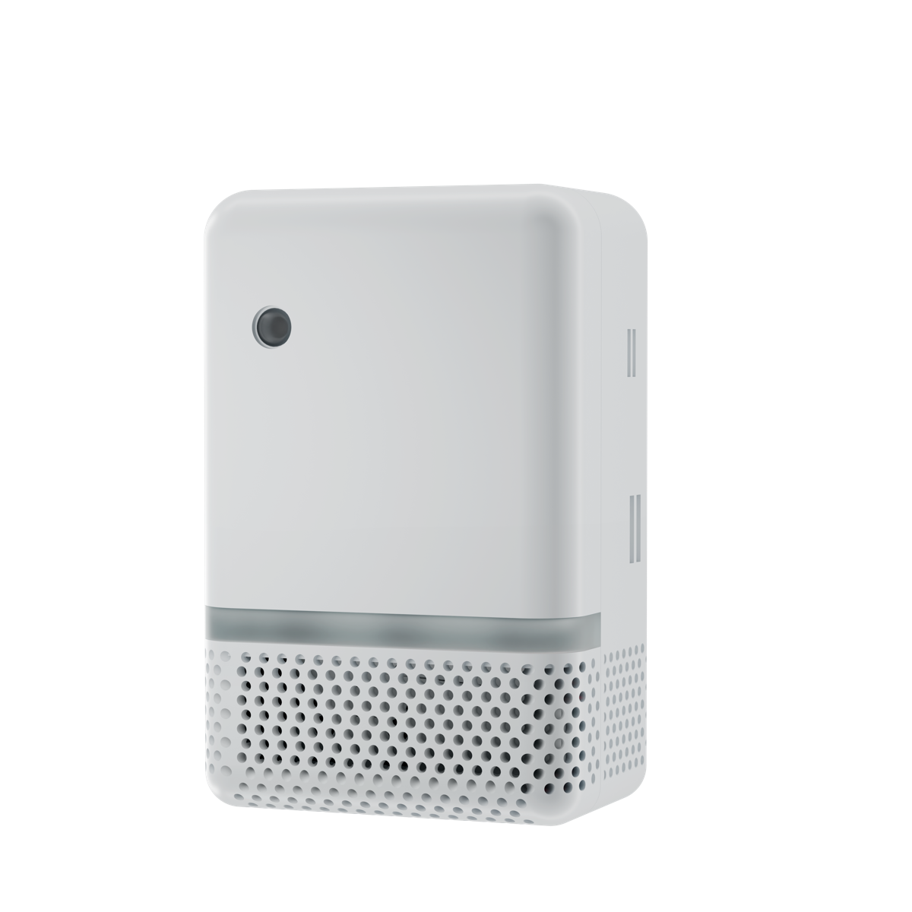

# UltimateSensor Mini V2 ESPHome Firmware

UltimateSensor Mini V2 is sold as standard hardware with LD2412 + LD2450. The optional LD2460 is an upgrade module: customers remove/replace the LD2450 module, install the LD2460 module, and flash one of the `*-ld2460.yaml` firmware variants.

Leave the LD2412 installed. It remains the close-range/still-presence fallback and makes occupancy more reliable together with either LD2450 or LD2460.

## Package Layout

| Package | Purpose |
| --- | --- |
| `base.yaml` | Shared ESP32-C6 hardware, sensors, API, OTA, web server, status LEDs, LD2412, and combined occupancy logic |
| `tracking-ld2450.yaml` | Product pin wrapper for shared LD2450 tracking and Room Designer zones on GPIO18/GPIO19 |
| `tracking-ld2460.yaml` | Product pin wrapper for shared LD2460 tracking and Room Designer zones on GPIO4/GPIO5 |
| `wifi.yaml` | WiFi network stack, ESPHome captive portal, BLE Improv, WiFi diagnostics, W5500 held off/reset |
| `ethernet.yaml` | W5500 Ethernet firmware network stack and Ethernet diagnostics |
| `complete.yaml` | SPS30 particulate matter sensor and PM idle controls |

## Firmware Variants

Standard variants are for the product as shipped with LD2412 + LD2450.

| File | Network | SPS30 | Tracking radar |
| --- | --- | --- | --- |
| `ultimatesensor-mini-v2-wifi-basic.yaml` | WiFi | No | LD2450 |
| `ultimatesensor-mini-v2-wifi-complete.yaml` | WiFi | Yes | LD2450 |
| `ultimatesensor-mini-v2-ethernet-basic.yaml` | Ethernet W5500 | No | LD2450 |
| `ultimatesensor-mini-v2-ethernet-complete.yaml` | Ethernet W5500 | Yes | LD2450 |

LD2460 upgrade variants are only for devices where the LD2450 module has been removed/replaced by the optional LD2460 module.

| File | Network | SPS30 | Tracking radar |
| --- | --- | --- | --- |
| `ultimatesensor-mini-v2-wifi-basic-ld2460.yaml` | WiFi | No | LD2460 |
| `ultimatesensor-mini-v2-wifi-complete-ld2460.yaml` | WiFi | Yes | LD2460 |
| `ultimatesensor-mini-v2-ethernet-basic-ld2460.yaml` | Ethernet W5500 | No | LD2460 |
| `ultimatesensor-mini-v2-ethernet-complete-ld2460.yaml` | Ethernet W5500 | Yes | LD2460 |

ESPHome Ethernet and WiFi are kept as separate firmware variants. The WiFi variants keep the W5500 powered off and held in reset. The Ethernet variants power the W5500 and expose Ethernet network info sensors.

Mini V2 WiFi firmware uses the SmartHomeShop branded setup portal on top of the ESPHome captive portal. The page configures WiFi, Home Assistant, SmartHomeShop App cloud, and the firmware choice between WiFi/Ethernet and Basic/Complete. BLE Improv remains available as an alternative provisioning method. Serial Improv is intentionally not included on ESP32-C6 because ESPHome requires the serial logger for it and both hardware UARTs are reserved for LD2412 and LD2450/LD2460.

## Radar Policy

- Factory default: keep LD2412 installed and use LD2450 firmware.
- LD2460 upgrade: remove/replace the LD2450 module, install LD2460, and flash a `*-ld2460.yaml` firmware file.
- Do not remove LD2412 for normal installs. It is the reliable presence fallback.
- `Occupancy` is always `LD2412 presence OR tracking radar presence`.
- The standard LD2450 firmware exposes Bluetooth/configuration controls for the LD2450.
- LD2450 tracking and zones are maintained centrally in `smarthomeshop/ld2450`.
- LD2460 tracking and zones are maintained centrally in `smarthomeshop/ld2460`.
- These local tracking files only select the correct product pins and shared packages.

## Room Designer Compatibility

| Tracking radar | Live targets | Room Designer writeback | Zone engine |
| --- | --- | --- | --- |
| LD2450 | 3 targets | Yes | 4 polygon zones, 2 exclusions, 2 entry lines |
| LD2460 | 5 targets | Yes | 4 polygon zones, 2 exclusions, 2 entry lines |

Both variants expose the same Home Assistant entity and action contract. LD2460 target coordinates are converted from meters to the millimeters used by Room Designer and the on-device zone engine.

## Pin Map

| Function | GPIO |
| --- | --- |
| I2C SDA | GPIO6 |
| I2C SCL | GPIO7 |
| LD2412 TX/RX | GPIO21 / GPIO20 |
| LD2450 TX/RX, standard hardware | GPIO18 / GPIO19 |
| LD2460 TX/RX, optional upgrade | GPIO4 / GPIO5 |
| W5500 CLK | GPIO1 |
| W5500 MOSI | GPIO11 |
| W5500 MISO | GPIO10 |
| W5500 CS | GPIO0 |
| W5500 interrupt | GPIO12 |
| W5500 reset | GPIO13 |
| W5500 power enable | GPIO2, inverted |
| Status LED | GPIO23 |
| RGB status LEDs | GPIO22, 3x WS2812/GRB |

## Notes

- Basic variants omit `complete.yaml`.
- Complete variants include `complete.yaml`, which adds the SPS30 at I2C address `0x69`.
- SCD41 default temperature offset is `13.2` based on the local V2 test YAML.
- SCD41 default humidity offset is `3.0` based on the local V2 test YAML.
- GPIO4/GPIO5 are ESP32-C6 strapping pins. The schematic uses them for LD2460; make sure the LD2460 UART does not pull boot levels into an invalid state.
